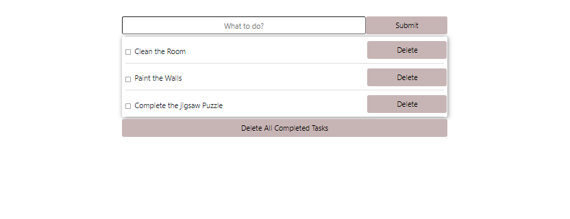

# Todo List
A project based on JS that allows users to keep track of their tasks. The tasks can be edited and reordered to the user's desire.


## Project Description
This JS project allows users to keep their days organised by allowing them to add, mark, order and edit tasks as they wish.
Users can:
- Create tasks
- Change the display order of the tasks by dragging them from the list items(excluding text, button and checkbox)
- Mark their tasks as complete by using the checkboxes
- Edit the description of their tasks by clicking on the current description text. ***to accept the changes, simply click outside of the edit area***
- Delete the tasks by clicking the "Delete" button located on the list item
- Delete all tasks marked as complete by clicking on the "Clear All Completed Tasks" button

This way, users can keep their to-do list clean and organised for a productive day.


## Screenshot of the page



## Built With

- HTML
- CSS
- JAVASCRIPT
- BOOTSTRAP


## Getting Started

1. Open Terminal.
2. Navigate to your desired location to download the contents of this repository.
3. Copy and paste the following code into the Terminal: git clone https://github.com/Zibilyonik/restaurant-page/tree/restaurant
4. ```cd todo-list```.
5. Install the required node modules by running `npm install` command.
6. After installing all the required node modules, you can run the project on your own server using `npm run start` or just use the index.html file to preview it.


## Contributors

👤 **Onur Onat Surmeli**

- [GitHub](https://github.com/Zibilyonik)
- [Twitter](https://twitter.com/OnurSurmeli2)
- [LinkedIn](https://www.linkedin.com/in/onuronatsurmeli/)


## 🤝 Contributing

Contributions, issues and feature requests are welcome!

Feel free to check the [issues page](issues/).

## Show your support

Give a ⭐️ if you like this project!

